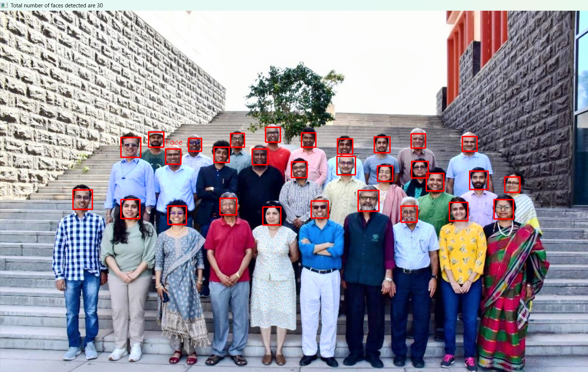

# Lab 5 - Face Detection and Clustering

## Aim
The objective of this lab is to:
- Detect human faces in images using a pre-trained Haar Cascade classifier.
- Extract color-based features from the detected facial regions.
- Apply KMeans clustering to group faces based on facial features.
- Perform template-based classification using a reference face.
- Visualize clustering results through 2D feature plots and centroids.

---

## Methodology

1. **Face Detection**
The Haar Cascade classifier was implemented to identify facial regions in two primary sources: a group faculty photograph and a single template reference image.

2. **Feature Extraction**
For every detected face, the following processing steps were performed:
- The specific face region was cropped from the original image.
- The image data was converted from BGR to the HSV color space.
- Mean Hue and Saturation values were calculated for each region.
- Every face was represented as a 2D feature vector for mathematical analysis.

3. **Unsupervised Clustering**
The KMeans algorithm was initialized with two clusters. The model processed the 2D feature vectors to group the faces based on their chromatic similarities and calculated the resulting cluster centroids.

4. **Template Based Classification**
A separate template face was processed using the same extraction pipeline. Its Hue and Saturation values were computed, and the trained model was used to map this template to the nearest cluster based on Euclidean distance to the centroids.

---

## Visualizations and Results

### 1. Face Detection on Group Image
A total of 30 faces were successfully detected within the faculty group image.

---

### 2. Face Clustering Based on Hue and Saturation
The extracted features were plotted in a 2D space to observe the distribution of the group.

---

### 3. KMeans Cluster Plot with Centroids
The application of KMeans resulted in two distinct groups, with centroids marked to show the center of each cluster.

---

### 4. Clustering with Template Face Included
The reference template was projected into the existing feature space to visualize its position relative to the faculty groups.

---

### 5. Final KMeans Classification Plot
The template face was assigned to a specific cluster, confirming the model's ability to classify new data points.

---

## Key Findings
- The Haar Cascade classifier successfully identified all visible subjects in the group image.
- Hue and Saturation provided an effective low-dimensional feature representation for skin tone and lighting.
- KMeans separated the dataset into two distinct color-based clusters with clear boundaries.
- The template face was mapped to a cluster based on feature similarity to the group data.
- 2D feature space visualization provided an interpretable method for verifying clustering accuracy.

---

## Conclusions
This lab demonstrates that classical computer vision techniques can be integrated with unsupervised learning to perform face-based grouping. By utilizing the HSV color space, we reduced data dimensionality while maintaining essential visual characteristics. The template-based classification confirmed that a new sample can be accurately categorized by measuring its distance to established cluster centroids.